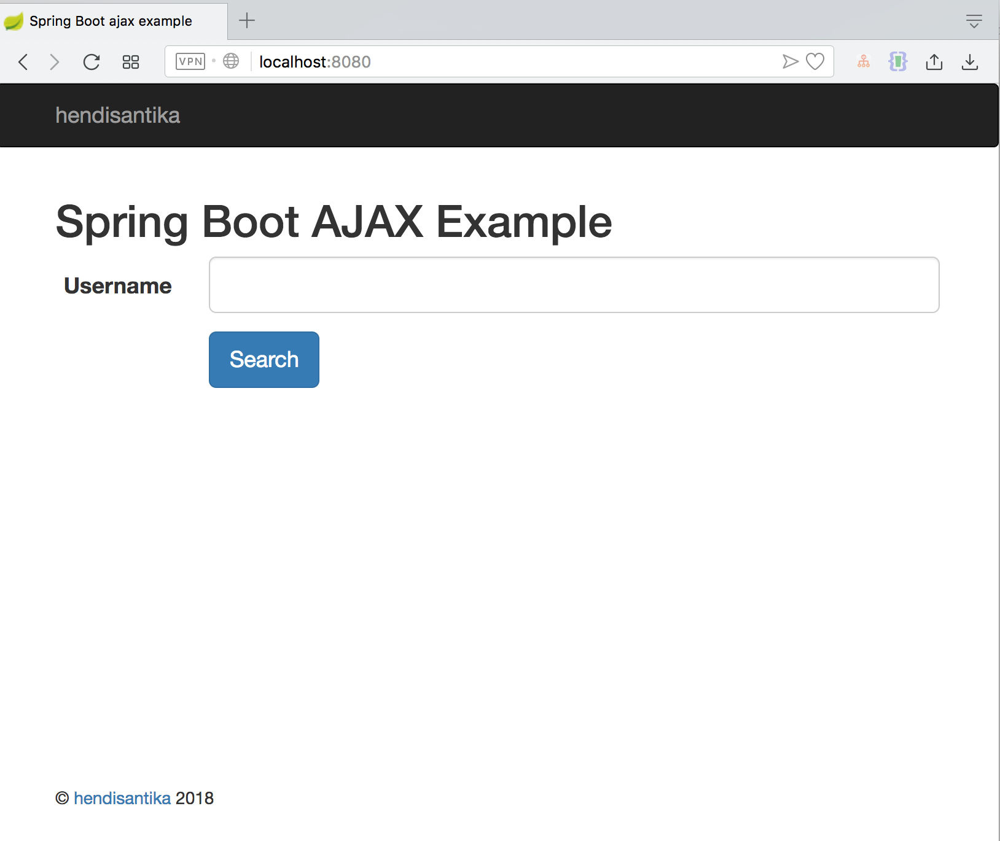
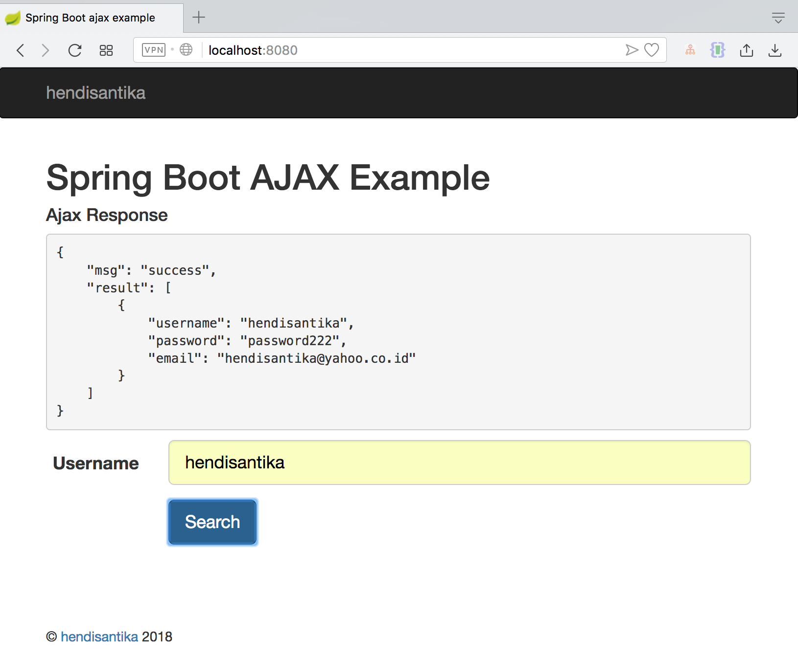

# Spring Boot file upload example – Ajax and REST

This article shows you how to upload files in Spring Boot web application (REST structure), using Ajax requests.

Tools used in this article :

* Spring Boot 1.5.15.RELEASE
* Spring 4.3.7.RELEASE
* Thymeleaf
* jQuery (webjars)
* Maven
* Embedded Tomcat 8.5.6
* Google Chrome Browser (Network Inspect)
* IntelliJ IDEA Ultimate 2018.2

Home Page

Search Page

